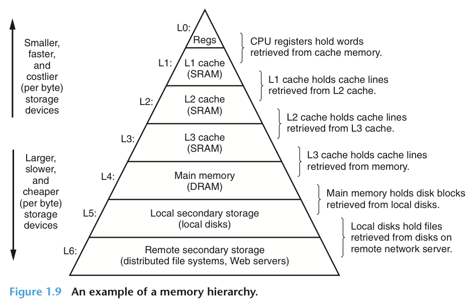
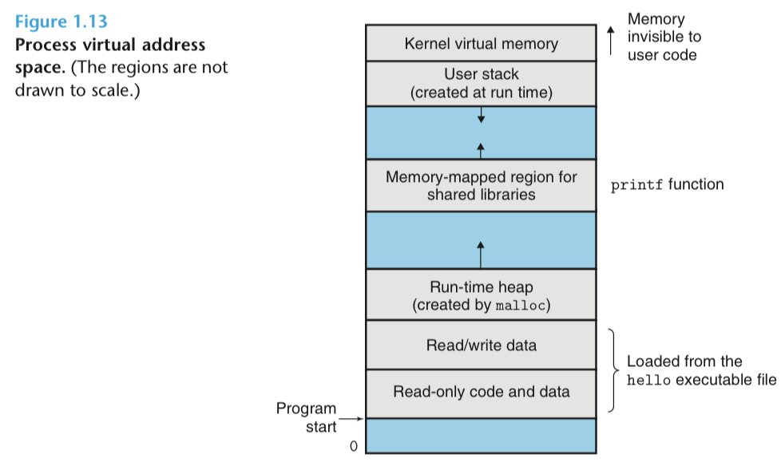

# Chapter 1

[TOC]

## Information = Bits + Context

**Computer system.** Hardware and systems software that work together to run application programs.

**Text file.** Consists exclusively of ASCII characters.
- Source code, etc.

**Binary file.** Files that are not text files.

**Executable object file/program.** Packages low-level machine-language instructions compiled from source code. Stored as binary disk file.

## Compilation System

**Compilation system.** Programs that translate source file to object file.
- Preprocessor
    - `hello.c` to `hello.i `
    - Resolve directives that begin with “#”, e.g., include statements, constant definitions, macros.
- Compiler
    - `hello.i` to `hello.s`
    - Translates source code text file into assembly-language text file.
- Assembler
    - `hello.s` to `hello.o`
    - Translates assembly-language text file into machine-language instructions.
    - Packages in relocatable object program.
    - Stored in binary object file.
- Linker
    - Links precompiled object file of library functions (e.g., `printf.o`) with `hello.o`.

## Hardware Organization

**Word.** A fixed-sized chunk of bytes that is handled as a unit by the processor hardware.
- Fundamental system parameter.
- Most machines’ word size is 4 bytes (32 bits) or 8 bytes (64 bits).

### Bus

**Bus.** Electrical conduit that carries bytes (words) of information between components of the hardware system.

### I/O Devices

**I/O devices.** The system’s connection to the external world.
- Typical I/O devices:
    - Keyboard and mouse: User input
    - Display: User output
    - Disk: Long-term storage of data and programs
- Connect to the I/O bus via controller (chip in motherboard) or adapter (plug-in on motherboard)

**Main memory.** Temporary storage device that holds both a program and its data while the processor is executing the program.
- Physically: A collection of dynamic random access memory (DRAM) chips.
- Logically: A linear array of bytes.

### Processor

**Processor.** The engine that interprets or executes instructions stored in main memory.
- Program counter (PC): Points at (contains the address of) some machine-language instruction in main memory.
- Operate according to its instruction set architecture.

**Register file.** A small storage device in the processor that consists of word-size registers, each with a unique name.

**Arithmetic/logic unit (ALU).** A component in the processor that computes new data and addresses.

#### Instruction set operations

**Load.** Copy (with overwrite) a byte/word from main memory into a register.

**Store.** Copy (with overwrite) a byte/word from a register into main memory.

**Operate.** Copy two registers into the ALU, perform arithmetic operation, and store (with overwrite) result in a register.

**Jump.** Copy (with overwrite) a word from the instruction into the program counter (so that the processor “jumps” to this command).

Executing `hello` program:
1. Type `./hello`: Shell reads each char into a register and stores it in memory.
2. Type `Enter`: Shell loads the executable `hello` file from disk to main memory
    1. Copies code and data in the `hello.o` object file from disk to main memory via direct memory access (DMA) without passing through the processor
3. Shell executes the machine-language instructions in `hello.o`’s `main` routine.

## Caches

**Processor-memory gap.** The phenomenon that it’s easier to make processors run faster than to make main memory run faster.

**Cache memories.** Temporary staging areas for information that the processor is likely to need in near future.

**Memory hierarchy.** Storage at one level serves as cache for storage at the next level.

## Operating System

**Operating system.** A layer of software interposed between the application program and the hardware.
- Protects hardware from misuse.
- Provides uniform interface for application programs to manipulate low-level hardware devices.
    - Fundamental abstractions
        - Files abstract I/O devices.
        - Virtual memory abstracts main memory and disk I/O devices.
        - Processes abstract processor, main memory, and I/O devices.
### Processes

**Processes.** Operating system’s abstraction for a running program.
- Processes can run concurrently, each appearing to have exclusive use of the hardware.
- A single CPU can appear to execute multiple processes concurrently by having the processor switch among them.

**Context.** State information that the processor needs in order to run.
- Current values of the PC, contents of main memory, etc.

**Context switch.** Transfer control from current process to another process: Save the context of current process, restore the context of the other process, and pass control to the other process.
- E.g., shell process -> hello process -> shell process.

**Kernel.** Portion of the operating system code that resides in memory and manages process switching.

### Threads

**Thread.** Execution unit in a process.
- Threads are more efficient than processes.
- Multi-threading is one way to make programs run faster with multiple processors.

### Virtual Memory

**Virtual memory.** Abstraction that provides the illusion that each process has exclusive use of the main memory.

From bottom to top:

**Program code and data.** Initialized directly from the executable object file.

**Run-time heap.** Expands and contracts at runtime as a result of `malloc` and `free`.

**Shared libraries.** C standard library and the math library.
- Dynamic linking: Loads and links shared libraries needed by an executable when it is executed.

**User stack.** Grows when we call a function, contracts when we return a function.

**Kernel virtual memory.** Reserved for kernel.

### Files

**File.** A sequence of bytes.
- Every I/O device is modeled as a file.

### Network

**Network.** From an individual system’ point of view, network is just another I/O device.

## Themes

### Amdahl’s Law

**Amdahl’s law.** When we speed up part of a system, the effect on the overall system performance depends on
1. How significant this part was, and 
2. How much it sped up.

E.g., suppose:
- Original overall execution time: $T_\text{old}$
- Some part requires a fraction $\alpha$ of this time
- Improve this part by factor of $k$
Then:
- New overall execution time:
$$
T_\text{new} = (1-\alpha)T_\text{old} + (\alpha T_\text{old})/k
$$

So the overall improvement is
$$
T_\text{old}/T_\text{new} = \frac{1}{(1-\alpha) + \alpha/k}
$$

Note that if we speed up this part so that it takes negligible amount of time (take $k$ to infinity), the overall improvement would be
$$
\frac{1}{(1-\alpha)
$$

### Concurrency and Parallelism

**Concurrency.** System with multiple simultaneous activities.

**Parallelism.** The use of concurrency to make a system run faster.

**Thread-level concurrency.** Allows multiple control flows executing within a single process.

**Hyperthreading.** Technique that allows a single CPU to execute multiple flows of control.

**Instruction-level parallelism.** Allows processor to execute multiple instructions at one time.

**Superscalar processor.** Execution rates faster than 1 instruction per cycle.

**Single-instruction, multiple-data (SIMD) parallelism.** Special hardware that allows a single instruction to cause multiple operations to be performed in parallel.
- Used to speed up applications that process image, sound, and video data.

