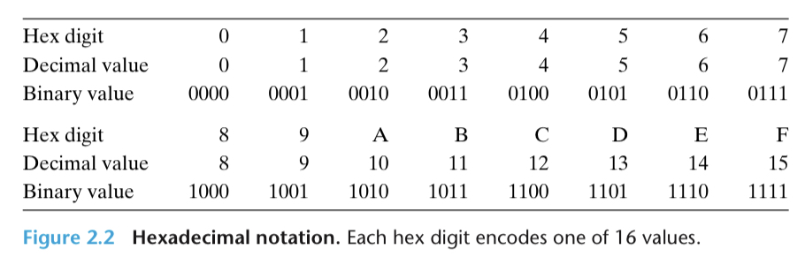
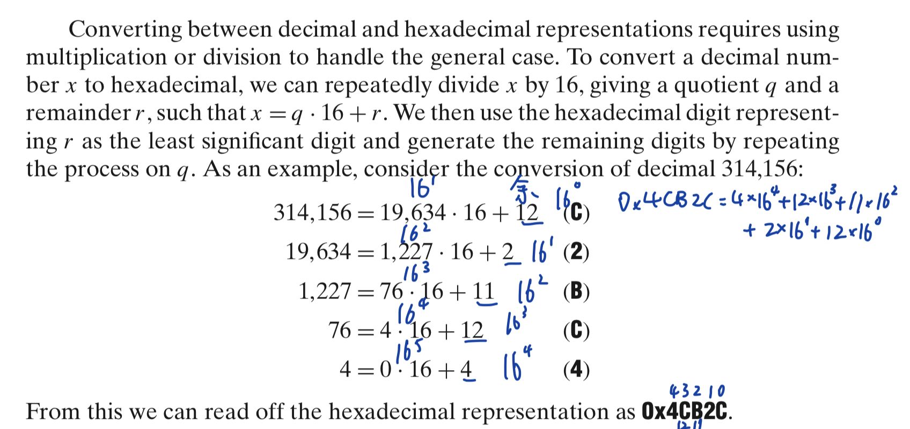
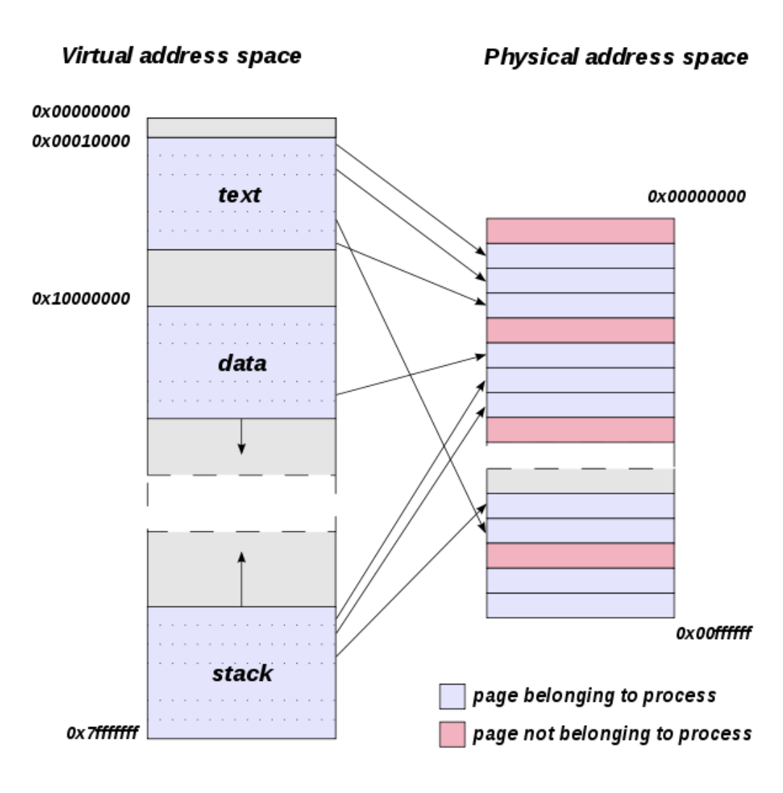
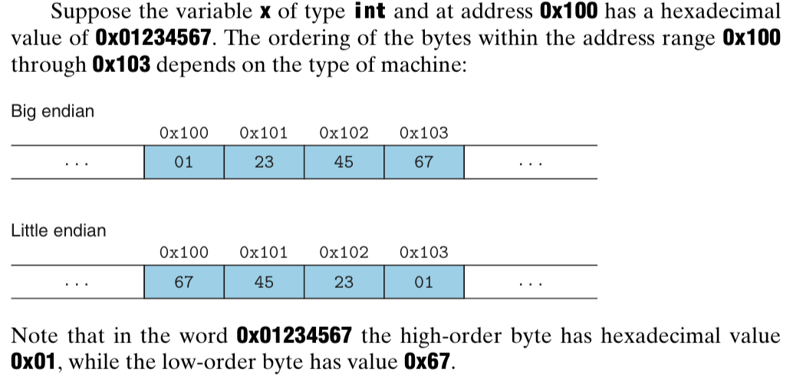
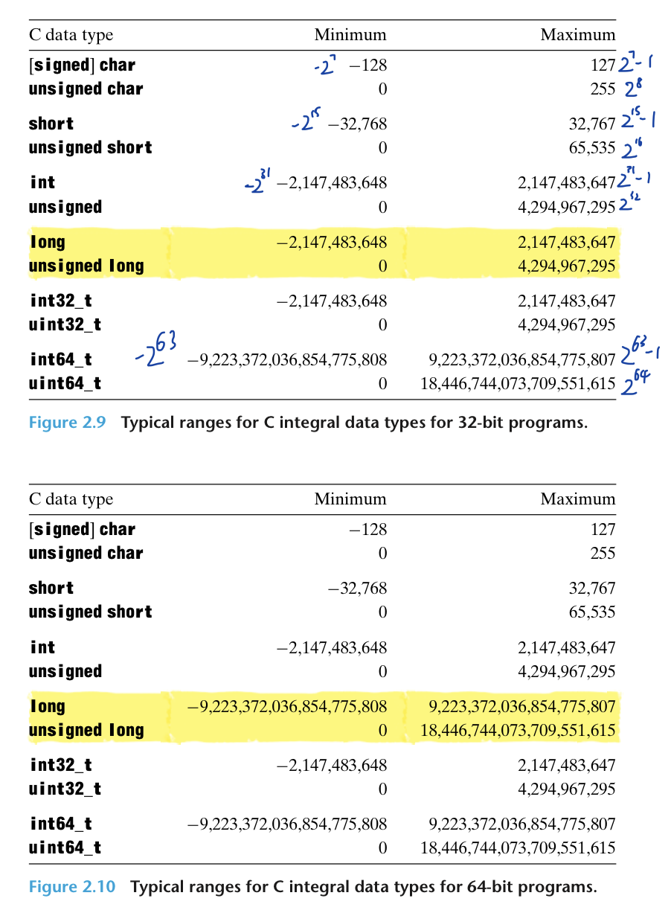
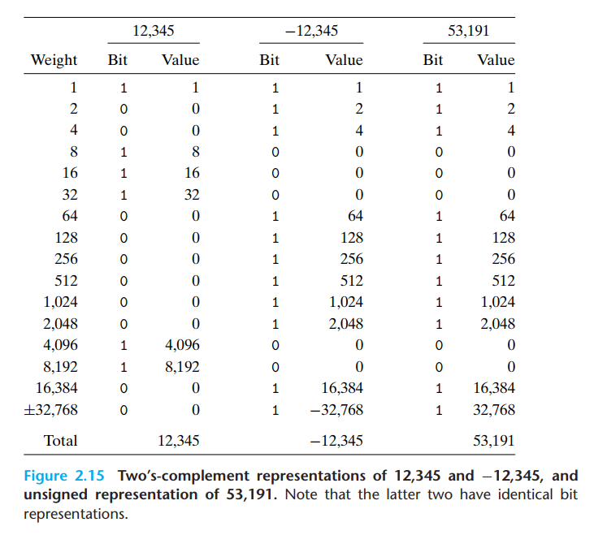
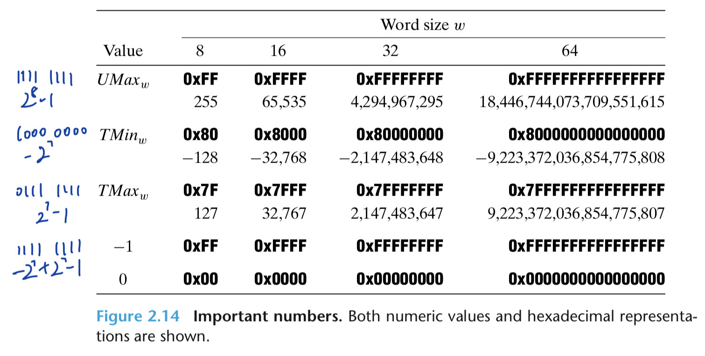

# Chapter 2

[TOC]

## Information Storage

**Byte.** 8 bits, the smallest addressable unit of memory.

**Virtual memory.** Abstraction of physical memory as a large array of bytes.
- Relies on dynamic random access memory (DRAM), flash memory, disk storage, hardware, and operating system software.

**Address.** Unique identifier (encoded by a word) assigned to each byte of memory.

**Virtual address space.** The set of all possible addresses.

### Hexadecimal Notation

**Hexadecimal numbers.** The value of a single byte (8 bits) is in $[00000000, 11111111]$ in binary, $[0, 255]$ in decimal, and $[00, \text{FF}]$ in hexadecimal.

Motivation for hexadecimal notation:
- Binary <=> hex is straightforward, one hex digit at a time.

- Decimal <=> hex is faster than decimal <=> binary


|  Decimal  | Hexadecimal | Binary |
| --- | --- | --- |
| $2^{11} = 2^{3+4\times 2}= 2^3 \times (2^4)^2 = 8 \times 16^2 $| 0x800 | $100000000000$ |
| 3 | 0x3 | $0011$ |
| | 0x25B9D2 | $0010 0101 1011 1001 1101 0010$ |

### Data sizes

For a machine with $\omega$-bit word size, its virtual address space is $[0, 2^{\omega}-1]$ (each address is encoded in a word). Each virtual address points to a byte in physical memory.
- A 32-bit machine has $2^{32}-1 ~ 4\cdot 10^9$ virtual addresses, which is 4 GB (gigabytes).
- A 64-bit machine has $2^{64}-1$ virtual addresses.


**Single precision.** 4-byte floating point format.

**Double-precision.** 8-byte floating point format.

A multi-byte object is stored as a contiguous sequence of bytes, with the address of the object given by the smallest address of the bytes used.

**Little endian.** Store objects in memory ordered from least significant byte to most.

**Big endian.** From most significant byte to least.


Conversion between big/little endian machines in network communication: Sending machine internal representation <=> network standard <=> receiving machine internal representation.

**Dissembler.** A tool that determines the instruction sequence represented by an executable program file.

### Boolean Algebra

**Bit vectors.** Strings of 0s and 1s of some fixed length $\omega$.
- Can represent finite sets: Can encode any subset $A \subseteq \{0,1,\ldots,\omega-1\}$ with bit vector $[a_{\omega-1}, \ldots, a_1, a_0]$, where $a_i = 1$ if and only if $i\in A$.
    - E.g., $A=\{0,3,5,6\}$ can be encoded by $a=[01101001]$ (reverse the positions).
- |: Set union
- &: Set intersection
- ~: Set complement

**Mask.** A bit pattern that indicates a selected set of bits within a word.
- E.g., 0xFF selects the lower-order byte of a word.

### Shift operations

**Left shift.** x<<k: $[x_{\omega-1}, x_{\omega-2}, \ldots, x_0]$ to $[x_{\omega-1}, x_{\omega-2}, \ldots, x_0, 0, \ldots, 0]$ with k trailing 0s.

**Logical right shift.** x>>k: $[0, \ldots, 0, x_{\omega-1}, x_{\omega-2}, \ldots, x_k]$.
- Usually used for unsigned data.
- Written as x >>> k in Java.

**Arithmetic right shift.** x>>k: $[x_{\omega-1}, \ldots, x_{\omega-1}, x_{\omega-1}, x_{\omega-2}, \ldots, x_k]$.
- Usually used for signed data.

**Modular shift.** For x with $\omega$ bits, x >> k and x << k are usually treated as x >> or << k mod $\omega$.
- This is guaranteed in Java but not in C.

## Integer Representations

### Integral Data Types

**Integral data types.** Data types that represent finite ranges of integers.
- Numbers of bytes allocated for each data type depends on whether the program is compiled for 32 or 64 bits.


### Encodings

#### Unsigned

**Unsigned.** For binary vector $\vec{x} = [x_{\omega-1}, x_{\omega-2},\ldots,x_0]$:
$$
B2U_{\omega}(\vec{x}) := \sum_{i=0}^{\omega-1}x_i2^i
$$
is the unsigned encoding of $\vec{x}$.

- E.g., $B2U_4([1011]) = 1\cdot 2^3 + 0\cdot 2^2 + 1\cdot 2^1 + 1\cdot 2^0 = 11$.
- $UMin_{\omega} = [00\cdots 0] = 0$.
- $UMax_{\omega} = [11\cdots1] = \sum_{i=0}^{\omega-1}x_i2^i = 2^{\omega}-1$.
- So $B2U_{\omega}: \{0,1\}^{\omega} \rightarrow \{0,\ldots,UMax_{\omega}\}$.
- Bijection.

#### Signed

**Two’s complement.** For binary vector $\vec{x} = [x_{\omega-1}, x_{\omega-2},\ldots,x_0]$:
$$
B2T_{\omega}(\vec{x}) := -x_{\omega-1}2^{\omega-1} + \sum_{i=0}^{\omega-2}x_i2^i
$$
is the two's complement encoding of $\vec{x}$.

- E.g., $B2T_4([1011]) = -1\cdot 2^3 + 0\cdot 2^2 + 1\cdot 2^1 + 1\cdot 2^0 = -5$.

- The most significant bit, $x_{\omega-1}$, is the sign bit.

- $TMin_{\omega} = [10\cdots 0] = -2^{\omega-1}$.

- $TMax_{\omega} = [01\cdots 1] = 0\cdot (-2^{\omega-1}) + 2^{\omega-2} + 2^{\omega-3} + \cdots + 2^1 + 2^0 = 2^{\omega-1}-1$. Recall geometric partial sum formula
  $$
  a + ar + ar^2 + \cdots + ar^n = a\left(\frac{1-r^{n+1}}{1-r}\right).
  $$

- So $B2T_{\omega}:\{0,1\}^{\omega}\to \{-2^{\omega-1},\cdots,2^{\omega-1}-1\}$.

- Bijection.

- Two’s complement: $-x = 2^{\omega}-x$ (a single two).



Given the binary representation of $-12345$, how do we know that the binary representation of $12345$ is obtained by inverting each bit and adding $1$?

We know that due to the different coefficient in front of the signed bit, the signed binary representation of $-12345$ and its unsigned counterpart $53191$ is $2^{16}$ apart. That is, $53191 - (-12345) = 2^{16}$. Thus, $12345 = 2^{16} - 53191$.

By the definition of binary calculation, we also know that the binary representation of $2^{16} - 53191 = [10\cdots 0] - 53191 = [10\cdots 0] - [1100 1111 1100 0111]$, which is obtained by inverting each bit in the binary representation of $53191$ and adding $1$.

```
   10000000000000000
-	1100111111000111
=	0011000000111001
```

The above is precisely the binary representation of the additive inverse of $12345$.



**Ones’ complement.** For binary vector $\vec{x} = [x_{\omega-1}, x_{\omega-2},\ldots,x_0]$:
$$
B2O_{\omega}(\vec{x}) := -x_{\omega-1}(2^{\omega-1} - 1) + \sum_{i=0}^{\omega-2}x_i2^i
$$
is the ones’ complement encoding of $\vec{x}$.
- Symmetric: $|OMin_{\omega}| = |OMax_{\omega}| = 2^{\omega-1}$.
- Two encodings of 0: 
    - $+0 = [00\cdots 0]$
    - $-0 = [11\cdots 1]$ (due to the above symmetry)
- Ones’ complement: $-x = [11\cdots 1] - x$ (multiple ones).

**Sign magnitude.** For binary vector $\vec{x} = [x_{\omega-1}, x_{\omega-2},\ldots,x_0]$:
$$
B2S_{\omega}(\vec{x}) := (-1)^{x_{\omega-1} } \cdot \left(\sum_{i=0}^{\omega-2}x_i2^i\right)
$$
is the sign magnitude encoding of $\vec{x}$.
- Two encodings of 0: 
    - $+0 = [00\cdots 0]$
    - $-0 = [10\cdots 0]$
- Used with floating-point numbers.


