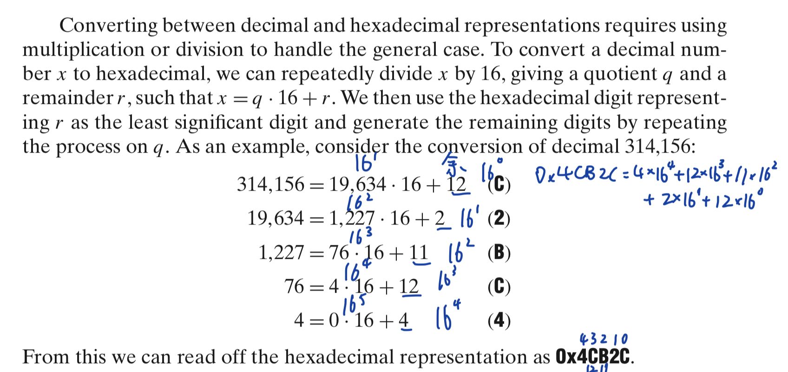
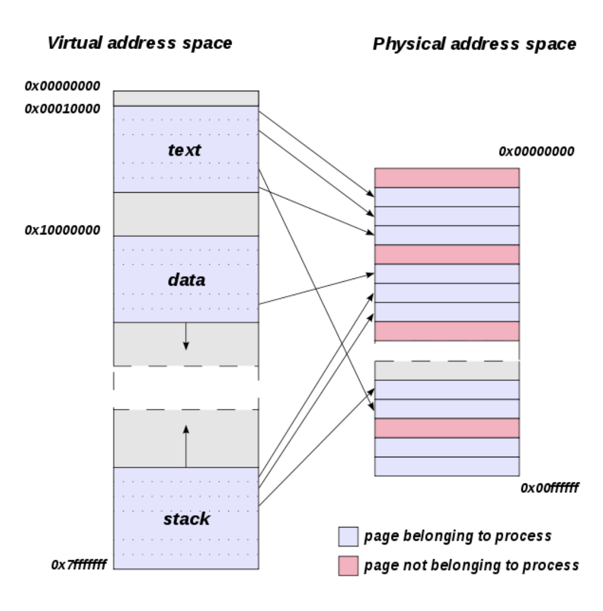
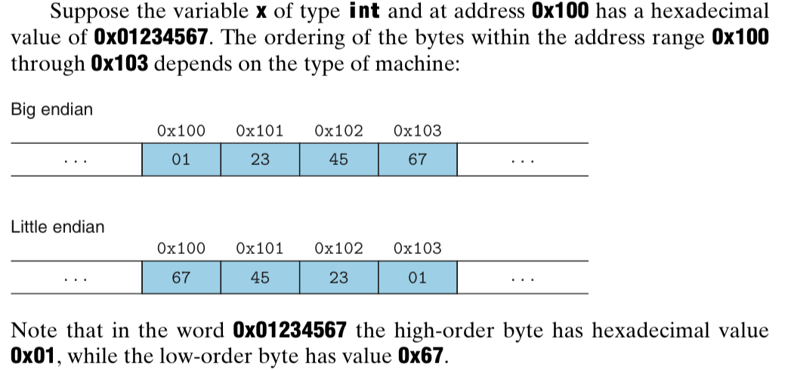

# Chapter 2

[TOC]

## Information Storage

**Byte.** 8 bits, the smallest addressable unit of memory.

**Virtual memory.** Abstraction of physical memory as a large array of bytes.
- Relies on dynamic random access memory (DRAM), flash memory, disk storage, hardware, and operating system software.

**Address.** Unique identifier (encoded by a word) assigned to each byte of memory.

**Virtual address space.** The set of all possible addresses.

### Hexadecimal Notation

**Hexadecimal numbers.** The value of a single byte (8 bits) is in $[00000000, 11111111]$ in binary, $[0, 255]$ in decimal, and $[00, \text{FF}]$ in hexadecimal.

Motivation for hexadecimal notation:
- Binary <=> hex is straightforward, one hex digit at a time.

- Decimal <=> hex is faster than decimal <=> binary

|  Decimal  | Hexadecimal | Binary |
| --- | --- | --- |
| $2^{11} = 2^{3+4\times 2}= 2^3 \times (2^4)^2 = 8 \times 16^2 $| 0x800 | $100000000000$ |
| 3 | 0x3 | $0011$ |
| | 0x25B9D2 | $0010 0101 1011 1001 1101 0010$ |

### Data sizes

For a machine with $\omega$-bit word size, its virtual address space is $[0, 2^{\omega}-1]$ (each address is encoded in a word). Each virtual address points to a byte in physical memory.
- A 32-bit machine has $2^{32}-1$ virtual addresses.
- A 64-bit machine has $2^{64}-1$ virtual addresses.

**Single precision.** 4-byte floating point format.

**Double-precision.** 8-byte floating point format.

A multi-byte object is stored as a contiguous sequence of bytes, with the address of the object given by the smallest address of the bytes used.

**Little endian.** Store objects in memory ordered from least significant byte to most.

**Big endian.** From most significant byte to least.

Conversion between big/little endian machines in network communication: Sending machine internal representation <=> network standard <=> receiving machine internal representation.

**Dissembler.** A tool that determines the instruction sequence represented by an executable program file.

### Boolean Algebra

**Bit vectors.** Strings of 0s and 1s of some fixed length $\omega$.
- Can represent finite sets: Can encode any subset $A \subseteq {0,1,\ldots,\omega-1}$ with bit vector $[a_{\omega-1}, \ldots, a_1, a_0]$, where $a_i = 1$ if and only if $i\in A$.
    - E.g., $A={0,3,5,6}$ can be encoded by $a=[01101001]$ (reverse the positions).
- |: Set union
- &: Set intersection
- ~: Set complement

**Mask.** A bit pattern that indicates a selected set of bits within a word.
- E.g., 0xFF selects the lower-order byte of a word.

