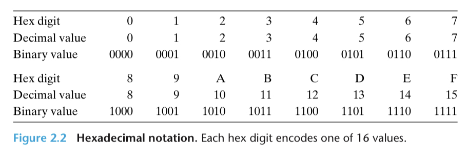

# Chapter 2

[TOC]

## Information Storage

**Byte.** 8 bits, the smallest addressable unit of memory.

**Virtual memory.** Abstraction of physical memory as a large array of bytes.
- Relies on dynamic random access memory (DRAM), flash memory, disk storage, hardware, and operating system software.

**Address.** Unique identifier assigned to each byte of memory.

**Virtual address space.** The set of all possible addresses.

### Hexadecimal Notation

**Hexadecimal numbers.** The value of a single byte (8 bits) is in $[00000000, 11111111]$ in binary, $[0, 255]$ in decimal, and $[00, FF]$ in hexadecimal.
- Motivation for hexadecimal notation is that the conversion between binary and hex is straightforward, one hex digit at a time.

